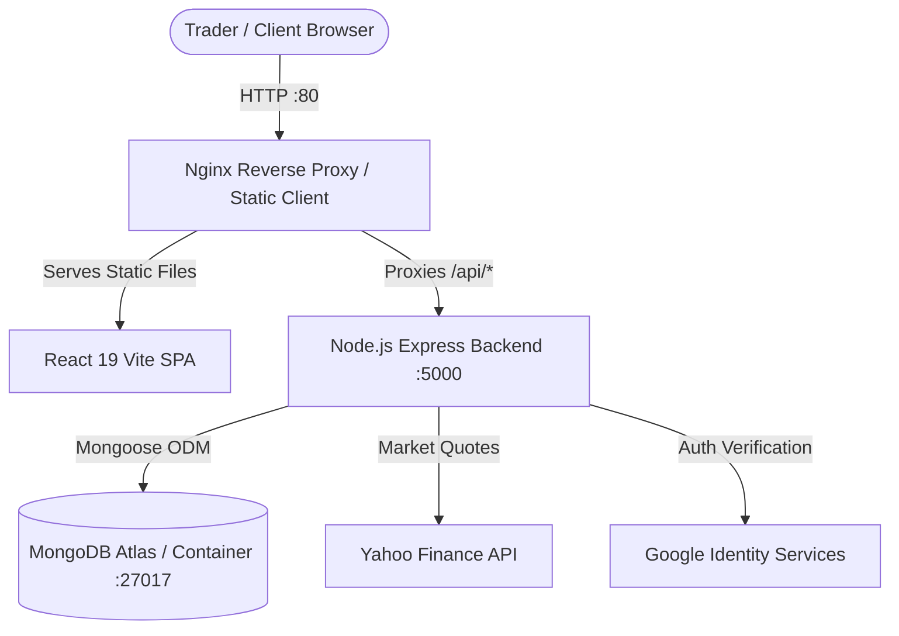
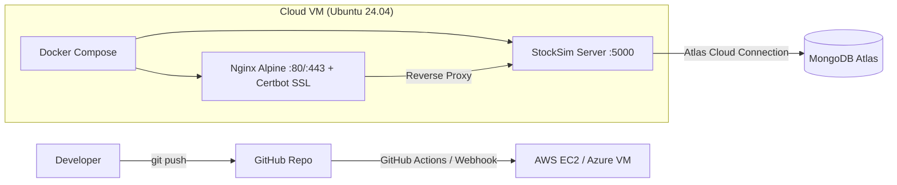

# 📈 StockSim Pro — Full-Stack MERN Real-Time Stock Market Simulator & Trading Platform

[](https://stocksimpro.in)
[](https://github.com/Teesha-Gokulgandhi/stocksim-pro/actions)
[-61DAFB?style=for-the-badge&logo=react)](https://github.com/Teesha-Gokulgandhi/stocksim-pro)
[](https://www.docker.com)
[](https://aws.amazon.com/ec2/)
[](https://opensource.org/licenses/MIT)

> **StockSim Pro** is an enterprise-grade **Full-Stack MERN** real-time stock trading simulator and financial portfolio platform. Built with **MongoDB, Express 5, React 19, and Node.js 20**, it enables users to trade real Indian equities (NSE / BSE) and US equities (NASDAQ / NYSE) with virtual currency using live data streams from **Yahoo Finance**, automated risk management triggers (Take-Profit / Stop-Loss), historical candlestick charting, market replay sessions, and an administrative telemetry suite. Containerized with **Docker** and deployed on **AWS EC2** behind an **Nginx** reverse proxy with SSL.

---

## 🌐 Live Application
- **Production Web App**: [https://stocksimpro.in](https://stocksimpro.in)
- **DevOps Master Handbook**: [StockSim_Pro_DevOps_Handbook.pdf](StockSim_Pro_DevOps_Handbook.pdf) (Complete A-to-Z Guide for DNS, Nginx, Docker & EC2)

---

## 📑 Table of Contents
1. [Key Features](#-key-features)
2. [Tech Stack & Architecture](#-tech-stack--architecture)
3. [⚡ Quickstart with Docker (Single Command)](#-quickstart-with-docker-single-command)
4. [🛠️ Manual Local Development](#️-manual-local-development)
5. [🌐 Hosting & Deployment Guide](#-hosting--deployment-guide)
   - [Option A: Production Cloud VM with Docker (AWS EC2 / Azure) — Maximum DevOps Learning](#option-a-production-cloud-vm-with-docker-aws-ec2--azure--maximum-devops-learning)
   - [Option B: Free-Tier PaaS (Vercel + Render + MongoDB Atlas)](#option-b-free-tier-paas-vercel--render--mongodb-atlas)
6. [🔐 Environment Variables](#-environment-variables)
7. [🌱 Database Seeding](#-database-seeding)
8. [🔄 CI/CD Automation (GitHub Actions)](#-cicd-automation-github-actions)
9. [📡 API Reference](#-api-reference)
10. [👥 Contributing & Git Workflow](#-contributing--git-workflow)

---

## ✨ Key Features

- **Live Market Data**: Multi-market quotes (INR ₹ and USD $) pulled directly via `yahoo-finance2` with in-memory caching and request de-duplication to prevent rate limits.
- **Interactive Technical Charts**: Real-time candlesticks and area charts supporting `1D`, `1W`, `1M`, `1Y`, `3Y`, and `5Y` time horizons.
- **Automated Risk Management**: Set automated **Take-Profit (TP)** and **Stop-Loss (SL)** triggers with background monitoring and order fulfillment.
- **Market Replay Sessions**: Historical market replay mode to backtest strategies against historical candles.
- **Dual-Currency Virtual Wallets**: Independent balance tracking in INR and USD with atomic transaction safety (prevents double-spending and overselling).
- **Admin Control Dashboard**: Inspect market telemetry, inject price shifts, seed holdings, and manage user portfolios.
- **Authentication**: JWT-based session security with bcrypt password hashing and optional Google OAuth2 integration.

---

## 🏛️ Tech Stack & Architecture

| Layer | Technologies |
| :--- | :--- |
| **Frontend** | React 19, Vite, React Router 7, Recharts, Lucide Icons, Vanilla CSS |
| **Backend API** | Node.js (v20+), Express 5, Mongoose ODM, `yahoo-finance2` |
| **Database** | MongoDB Atlas (Cloud) or MongoDB 7.0 Container |
| **Containerization** | Docker, Multi-Stage Builds, Docker Compose, Alpine Nginx |
| **CI/CD** | GitHub Actions (Automated Linting, Builds & Container Verification) |



---

## ⚡ Quickstart with Docker (Single Command)

The quickest way to run the complete stack (Frontend + Backend + MongoDB) on any machine with Docker installed:

### 1. Clone the repository
```bash
git clone https://github.com/Teesha-Gokulgandhi/stocksim-pro.git
cd stocksim-pro
```

### 2. Configure Environment (Optional)
If you wish to use a cloud MongoDB Atlas database, copy `.env.example` to `.env` and paste your `MONGO_URI`. Otherwise, Docker will automatically spin up a local MongoDB container for you!
```bash
cp .env.example .env
```

### 3. Launch with Docker Compose
```bash
docker compose up --build
```

### 4. Access the Application
- **Web App**: [http://localhost](http://localhost) (or `http://localhost:80`)
- **Backend API**: [http://localhost:5000/api](http://localhost:5000/api)
- **Health Check**: [http://localhost:5000/health](http://localhost:5000/health)

To stop the containers:
```bash
docker compose down
```

---

## 🛠️ Manual Local Development

If you prefer to run the client and server directly with Node.js on your host machine:

### Prerequisites
- Node.js v18+ or v20+
- A running MongoDB instance (Local MongoDB or MongoDB Atlas)

### 1. Install Dependencies
```bash
# Install server dependencies
cd server
npm install

# Install client dependencies
cd ../client
npm install
```

### 2. Configure Environment Files

**Backend (`server/.env`):**
```bash
cd server
cp .env.example .env
```
Edit `server/.env` with your settings:
```dotenv
PORT=5000
NODE_ENV=development
MONGO_URI=mongodb+srv://<user>:<password>@<cluster>.mongodb.net/stocksim-pro?retryWrites=true&w=majority
JWT_SECRET=your_super_secret_jwt_key_min_32_chars
CLIENT_ORIGIN=http://localhost:5173
QUOTE_CACHE_TTL_SECONDS=20
```

**Frontend (`client/.env`):**
```bash
cd client
cp .env.example .env
```
Ensure `client/.env` has:
```dotenv
VITE_API_URL=http://localhost:5000/api
```

### 3. Start Development Servers

Open two terminal windows:

```bash
# Terminal 1: Backend API
cd server
npm run dev      # Runs on http://localhost:5000
```

```bash
# Terminal 2: Frontend Client
cd client
npm run dev      # Runs on http://localhost:5173
```

---

## 🌐 Hosting & Deployment Guide

This project is tailored for both academic DevOps demonstration and zero-cost cloud portfolio hosting.

---

### Option A: Production Cloud VM with Docker (AWS EC2 / Azure) — Maximum DevOps Learning 🌟

This path aligns with **DevOps Syllabus Units 3 (Containers), 4 (Cloud & VM Provisioning), and 5 (Continuous Delivery)**.



#### Step 1: Provision Cloud Virtual Machine
1. **AWS**: Launch an `EC2 t2.micro` (Free Tier eligible) running **Ubuntu 24.04 LTS**.
2. **Security Group**: Open inbound ports:
   - `22` (SSH - restrict to your IP)
   - `80` (HTTP)
   - `443` (HTTPS)
3. Connect via SSH:
   ```bash
   ssh -i your-key.pem ubuntu@<YOUR_VM_PUBLIC_IP>
   ```

#### Step 2: Install Docker & Docker Compose on VM
```bash
sudo apt update && sudo apt upgrade -y
sudo apt install -y docker.io docker-compose-v2 git
sudo usermod -aG docker $USER
# Log out and log back in to apply docker group
newgrp docker
```

#### Step 3: Clone Repo & Run
```bash
git clone https://github.com/Teesha-Gokulgandhi/stocksim-pro.git
cd stocksim-pro
cp .env.example .env
nano .env # Set your MONGO_URI and JWT_SECRET
docker compose up -d --build
```
Your app is now running live at `http://<YOUR_VM_PUBLIC_IP>`!

#### Step 4: Add Domain & Free SSL with Let's Encrypt (Certbot)
To point your custom domain (e.g., `stocksim.yourdomain.com`):
1. Add an **A Record** in your DNS provider pointing to `<YOUR_VM_PUBLIC_IP>`.
2. Run Certbot to generate and auto-renew Let's Encrypt SSL certificates.

---

### Option B: Free-Tier PaaS (Vercel + Render + MongoDB Atlas)

If you need a zero-maintenance hosted URL for your portfolio without managing a Linux server:

1. **Database (MongoDB Atlas)**:
   - Create a free `M0` cluster.
   - Whitelist all IPs (`0.0.0.0/0` under Network Access).
   - Copy connection string into backend env.
2. **Backend (Render.com / Railway)**:
   - New Web Service connected to your GitHub repository.
   - Root Directory: `server`.
   - Build Command: `npm install`.
   - Start Command: `node index.js`.
   - Add Environment Variables: `MONGO_URI`, `JWT_SECRET`, `NODE_ENV=production`, `CLIENT_ORIGIN=https://your-frontend.vercel.app`.
3. **Frontend (Vercel)**:
   - Import Git repository.
   - Root Directory: `client`.
   - Build Command: `npm run build`.
   - Output Directory: `dist`.
   - Add Environment Variable: `VITE_API_URL=https://your-backend.onrender.com/api`.

---

## 🔐 Environment Variables

### Backend (`server/.env` or Docker env)
| Variable | Required | Default | Description |
| :--- | :---: | :---: | :--- |
| `PORT` | No | `5000` | Port Express listens on |
| `NODE_ENV` | No | `development` | `development` or `production` |
| `MONGO_URI` | **Yes** | — | MongoDB Atlas or local connection string |
| `JWT_SECRET` | **Yes** | — | 32+ char random string used to sign auth tokens |
| `JWT_EXPIRES_IN`| No | `7d` | JWT session expiry |
| `CLIENT_ORIGIN` | No | `http://localhost:5173` | Allowed CORS origins (comma-separated for multiple) |
| `QUOTE_CACHE_TTL_SECONDS` | No | `20` | Cache time-to-live for Yahoo Finance quotes |
| `GOOGLE_CLIENT_ID` | No | — | Optional Google OAuth 2.0 Web Client ID |

### Frontend (`client/.env` or Vite build arg)
| Variable | Required | Default | Description |
| :--- | :---: | :---: | :--- |
| `VITE_API_URL` | **Yes** | `http://localhost:5000/api` | Base URL for Express REST API |
| `VITE_GOOGLE_CLIENT_ID` | No | — | Google OAuth Client ID matching backend |

---

## 🌱 Database Seeding

To populate the stock universe with verified Indian and US tickers:

```bash
cd server
npm run seed
```
Or to run a comprehensive multi-user market simulation seed:
```bash
node server/scripts/seedProductionUniverse.js
```

---

## 🔄 CI/CD Automation (GitHub Actions)

This repository includes a production CI/CD workflow located at [`.github/workflows/ci.yml`](.github/workflows/ci.yml). 

Every `push` or `pull_request` to `main`:
1. **Automated Validation**: Checks out code and installs dependencies on Node 20.
2. **Production Build**: Compiles Vite frontend assets and verifies tree-shaking / bundle integrity.
3. **Container Testing**: Builds both `server` and `client` Docker images using Buildx to guarantee image reproducibility before deployment.

---

## 📡 API Reference

| Method | Endpoint | Auth | Description |
| :--- | :--- | :---: | :--- |
| `POST` | `/api/auth/register` | Public | Create new trading account |
| `POST` | `/api/auth/login` | Public | Email/Password login |
| `POST` | `/api/auth/google` | Public | Google OAuth2 token verification |
| `GET` | `/api/stocks` | Public | Paginated list of tradable stocks |
| `GET` | `/api/stocks/live` | Public | Paginated stocks with live Yahoo prices |
| `GET` | `/api/stocks/:symbol` | Public | Detailed quote + chart history |
| `POST` | `/api/trade/buy` | **Bearer** | Atomic market buy order |
| `POST` | `/api/trade/sell` | **Bearer** | Atomic market sell order |
| `GET` | `/api/user/portfolio` | **Bearer** | Live portfolio balance & P&L |
| `GET` | `/api/user/transactions` | **Bearer** | Historical order log |
| `POST` | `/api/admin/shift` | **Admin** | Inject simulated market volatility |
| `GET` | `/health` | Public | Microservice uptime & DB connectivity status |

---

## 👥 Contributing & Git Workflow

### Initializing & Pushing to GitHub

1. **Initialize Git**:
   ```bash
   git init
   git add .
   git commit -m "feat: initial commit with full-stack containerization and CI/CD"
   ```

2. **Add Remote & Push**:
   ```bash
   git branch -M main
   git remote add origin https://github.com/Teesha-Gokulgandhi/stocksim-pro.git
   git push -u origin main
   ```

---

## 🏆 Architectural Comparison: StockSim Pro vs Generic MERN Clones

| Feature Area | Typical College MERN Clones | **StockSim Pro (Production Grade)** |
| :--- | :--- | :--- |
| **Market Data** | Fake hardcoded Math.random() prices | **Real-time Yahoo Finance sync** with in-memory caching & rate-limit deduplication |
| **Market Scope** | Single fake index | **Dual-Market**: Indian NSE/BSE (₹ INR) & US NASDAQ/NYSE ($ USD) |
| **Order Automation**| Simple buy/sell buttons only | **Automated TP/SL (Take-Profit & Stop-Loss)** with background trigger checking |
| **Deployment** | Localhost only or single free Dyno | **Multi-stage Docker Compose, AWS EC2, Nginx Reverse Proxy & SSL** |
| **Security** | Plain text / basic JWT | **Bcrypt 10 rounds, Zod input validation, Express Rate Limiting, HTTPOnly ready** |
| **DevOps & CI/CD** | None | **Automated GitHub Actions workflow + Production DevOps Handbook PDF** |
| **Simulation Depth**| Current snapshot only | **Historical Market Replay Backtesting + Admin Volatility Injection Engine** |

---

## 🏷️ GitHub Topics & SEO Indexing Terms

```text
mern-stack | stock-market | stock-trading | trading-platform | stock-simulator | paper-trading
react19 | nodejs20 | express5 | mongodb-atlas | yahoo-finance | candlestick-charts
docker-compose | aws-ec2 | nginx-reverse-proxy | github-actions | ci-cd-pipeline
```

---

## 📄 License

This project is licensed under the MIT License — see the [LICENSE](LICENSE) file for details.
